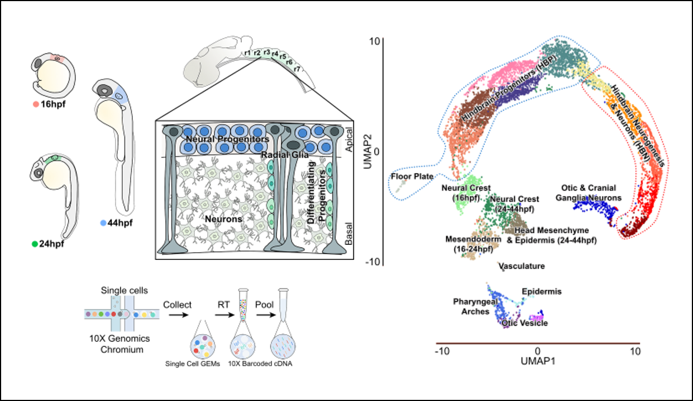

```{r knitr.options, include=FALSE}
knitr::opts_chunk$set(
  fig.path   = "figures/",
  cache      = TRUE,
  cache.lazy = FALSE,
  tidy       = TRUE,
  echo       = TRUE,
  warning    = FALSE,
  message    = FALSE
)
```

***

<br><br><br>



<br><br><br>

# Introduction
***

Segmentation of the vertebrate hindbrain leads to the formation of rhombomeres, each with a distinct anteroposterior identity. Specialised boundary cells form at segment borders that act as a source or regulator of neuronal differentiation. In zebrafish, there is spatial patterning of neurogenesis in which non-neurogenic zones form at bounderies and segment centres, in part mediated by Fgf20 signaling. To further understand the control of neurogenesis, we have carried out single cell RNA sequencing of the zebrafish hindbrain at three different stages of patterning. Analyses of the data reveal known and novel markers of distinct hindbrain segments, of cell types along the dorsoventral axis, and of the transition of progenitors to neuronal differentiation. We find major shifts in the transcriptome of progenitors and of differentiating cells between the different stages analysed. Supervised clustering with markers of boundary cells and segment centres, together with RNA-seq analysis of Fgf-regulated genes, has revealed new candidate regulators of cell differentiation in the hindbrain. These data provide a valuable resource for functional investigations of the patterning of neurogenesis and the transition of progenitors to neuronal differentiation. 

This project focuses on understanding the regulation of neurogenesis in the developing zebrafish hindbrain. Neural progenitors are stereotypically organized in neurogenic and non-neurogenic zones within each hindbrain segment. Previous work has shown that hindbrain boundaries and fgf20-expressing neurons are signalling centres which pattern neurogenesis. However, it is not known how the signalling centres are specified or act to regulate neurogenesis, and only a few molecular markers have been identified.

<br><br><br>

# Contents
***
* [Introduction](#introduction)
* [Data availability](#data-availability)
* [Setup](#setup)
* [Intergrated analysis (all cells)](#integrated-dataset,-all-cells)
* [Intergrated analysis (hindbrain only)](#integrated-dataset,-hindbrain-only)
* [16hpf analysis (hindbrain only)](#16hpf,-hindbrain-only)
* [24hpf analysis (hindbrain only)](#24hpf,-hindbrain-only)
* [44hpf analysis (hindbrain only)](#44hpf,-hindbrain-only)
* [Supervised analysis](#supervised-analysis)
* [Trajectory analysis (Monocle3)](#trajectory-analysis)
* [References](#references)
* [Session Info](#session-info)


<br><br><br>


# Data availability
***

Raw data are available from the NCBI's GEO under accession [GSE141428](https://www.ncbi.nlm.nih.gov/geo/query/acc.cgi?acc=GSE141428).

An interactive view of the data is available from the Broad's Single Cell Portal under project [SCP667](https://singlecell.broadinstitute.org/single_cell/study/SCP667/a-single-cell-transcriptome-atlas-of-the-developing-zebrafish-hindbrain).

NOTE: the 10X matrix files are too large to host on gitHub but may be downloaded from the Broad [here](https://singlecell.broadinstitute.org/single_cell/study/SCP667/a-single-cell-transcriptome-atlas-of-the-developing-zebrafish-hindbrain#study-download).

<br><br><br>


# Setup
***

* Load required R packages.
* Load lists of transcription factors from the AnimalTFDB3.0 database.
* Load cell annotation.
* Load individual 10X sample data: 16hpf, 24hpf, 44hpf.
* Load [Cellranger](https://support.10xgenomics.com/single-cell-gene-expression/software/pipelines/latest/using/aggregate) aggregated 10X dataset.
* Set colour palette.

<br><br>


```{r, directories, include=FALSE}
work.dir    <- "/camp/stp/babs/working/mitterr/projects/wilkinsond/monica.tambalo/hindbrain.10x/review.simple/"
setwd(work.dir)
results.dir <- paste(work.dir,"results/",sep='')
if(!dir.exists(results.dir)) { dir.create(results.dir) }
#source("/camp/stp/babs/working/mitterr/projects/wilkinsond/monica.tambalo/hindbrain.10x/review.simple/run_analyse_Rmd.R");
```


```{r setup}
# Load required R packages.
library(scater)
library(SingleCellExperiment)
library(Seurat)
library(ggplot2)
library(RColorBrewer)
library(gghalves)
library(reshape2)
library(patchwork)
library(ComplexHeatmap)
library(rtracklayer)
library(dplyr)
library(circlize)
library(viridis)
library(monocle3)

# Transcription factors from the [AnimalTFDB3.0 database](http://bioinfo.life.hust.edu.cn/AnimalTFDB/#!/).
tf.dat <- read.delim("data/Danio_rerio_TF.txt",header=T,sep="\t",stringsAsFactors=F);

# List of confirmed hindbrain cells from Supplementary Table S1.
hb.cells <- read.delim("data/HindbrainCells_SupplTable1.txt",header=T,sep="\t",stringsAsFactors=F,check.names=F)
hb.list  <- as.list(hb.cells)
hb.list  <- sapply(hb.list,function(x){x[x!=""]})

# Individually load the 16hpf, 24hpf and 44hpf datasets.
sample.info <- read.delim("data/aggregate_libraries.csv",header=T,sep=",",stringsAsFactors=F)
sample.list <- list()
for (r in 1:nrow(sample.info)) {
  dat.10x           <- Read10X(sample.info$location[r])
  dat.10x           <- CreateSeuratObject(counts = dat.10x, project = sample.info$library_id[r], min.cells = 0, min.features = 0)
  dat.10x$barcode   <- paste(rownames(dat.10x@meta.data),"-",r,sep='')
  dat.10x$hindbrain <- colnames(dat.10x) %in% hb.list[[sample.info$library_id[r]]]
  sample.list[[sample.info$library_id[r]]] <- dat.10x
}

# Import the 10x [Cellranger](https://support.10xgenomics.com/single-cell-gene-expression/software/pipelines/latest/using/aggregate) aggregated dataset containing normalised counts from the 3 individual stages.
mix           <- Read10X(data.dir = "data/")
mix           <- CreateSeuratObject(counts = mix, min.cells = 0, min.features = 0)
mix$barcode   <- rownames(mix@meta.data)
mix$hindbrain <- mix$barcode %in% hb.list[["aggregated"]]
sample.info$gem.group <- 1:nrow(sample.info)
mix$stage     <- sample.info$library_id[match(sub(".*-","",colnames(mix)),sample.info$gem.group)]

# Colour palette
getPalette  <- colorRampPalette(brewer.pal(9, "Set1"))
```

# QC
***

Flag outlier cells +/- 3 MADs away from the median in a dataset depended manner using the scater package.
```{r, QC, dependson=c("import.aggregated_10x")}
sce          <- SingleCellExperiment(assays = list(counts = as.matrix(mix@assays$RNA@counts)))
rowData(sce) <- data.frame(gene_short_name=rownames(mix@assays$RNA@counts),stringsAsFactors=F)
mito         <- grep("mt-",rowData(sce)$gene_short_name,value=F)
sce          <- calculateQCMetrics(sce, feature_controls=list(Mt=mito))

mix$total_counts             <- sce$total_counts
mix$total_features_by_counts <- sce$total_features_by_counts
mix$pct_counts_Mt            <- sce$pct_counts_Mt
mix$libsize.outlier          <- as.logical(isOutlier(mix$total_counts, nmads=3, type="both", log=TRUE, batch=mix$stage))
mix$feature.outlier          <- as.logical(isOutlier(mix$total_features_by_counts, nmads=3, type="both", log=TRUE, batch=mix$stage))
mix$mito.outlier             <- as.logical(isOutlier(mix$pct_counts_Mt, nmads=3, type="both", log=FALSE, batch=mix$stage))
mix$any.outlier              <- as.logical(mix$libsize.outlier | mix$feature.outlier | mix$mito.outlier)

qc.dat           <- melt(mix@meta.data[,c("barcode","total_counts","total_features_by_counts","pct_counts_Mt","stage")])
qc.dat.all       <- qc.dat
qc.dat.all$stage <- "integrated"
qc.dat           <- rbind(qc.dat,qc.dat.all)
qc.dat$stage     <- factor(as.character(qc.dat$stage),levels=c("16hpf","24hpf","44hpf","integrated"))
qc.dat$variable  <- factor(sub("pct_counts_Mt","Mitochondrial%",sub("total_features_by_counts","nGene",sub("total_counts","nUMI",qc.dat$variable))),levels=c("nUMI","nGene","Mitochondrial%"))
P0 <- ggplot(qc.dat,aes(x=stage,y=value+0.1,fill=stage)) + geom_half_violin(side="r",trim = FALSE, scale = "area") + geom_half_point(side="l",size=0.01,alpha=0.3,shape=20) + facet_grid(variable~.,scales="free_y")
P0 <- P0 + theme_bw() + theme(text = element_text(size=8)) + ylab("")
P0

#sapply(split(mix$libsize.outlier,mix$stage),table)[c("FALSE","TRUE"),c("16hpf","24hpf","44hpf")]
#sapply(split(mix$feature.outlier,mix$stage),table)[c("FALSE","TRUE"),c("16hpf","24hpf","44hpf")]
#sapply(split(mix$mito.outlier,mix$stage),table)[c("FALSE","TRUE"),c("16hpf","24hpf","44hpf")]
#sapply(split(mix$any.outlier,mix$stage),table)[c("FALSE","TRUE"),c("16hpf","24hpf","44hpf")]
```

<br><br><br>


# Integrated dataset, all cells
***

## Process

* Global-scaling normalisation of the data using the Seurat's "LogNormalize" function.  This normalises the feature expression measurements for each cell by the total expression, multiplies this by a scale factor (10000) and log-transforms the result.
* Identification of top 2000 most variable genes (feature selection).
* Scale the data by shifting expression such that mean expression across cells is 0 and the variance across cells is 1.  This gives equal weight in downstream analyses, so that highly-expressed genes do not dominate.
* Perform linear dimensional reduction (PCA).
* Determine dataset ‘dimensionality’.
* Graph-based clustering of cells.  A K-nearest neighbor (KNN) graph, with edges drawn between cells with similar gene expression patterns is created and subsequently partitioned into highly interconnected communities of cells with similar expression profiles.
* Non-linear dimensional reduction (UMAP).
* Determine cluster marker genes.
* Assign cell type identity.


```{r integrated.all.process, dependson=c("import.aggregated_10x")}

## Normalise data
mix <- NormalizeData(mix, normalization.method = "LogNormalize", scale.factor = 10000)

## Find variable genes
mix <- FindVariableFeatures(mix, selection.method = "vst", nfeatures = 2000)

## Scale data
mix <- ScaleData(mix, features = rownames(mix))

## PCA
mix <- RunPCA(mix, features = VariableFeatures(object = mix), npcs = 50, verbose = FALSE, ndims.print = NULL, nfeatures.print = NULL, reduction.key = "PC_", seed.use = 42, approx = FALSE, reduction.name="pca")
#mix <- JackStraw(mix, num.replicate = 100, dims=50)
#mix <- ScoreJackStraw(mix, dims = 1:50)
P1  <- ElbowPlot(mix, ndims = 50)
#P2  <- JackStrawPlot(mix.16hpf, dims = 1:50)

which.pc <- 1:30

## Find clusters
mix <- FindNeighbors(mix, dims = which.pc, verbose = FALSE, k.param = 20, compute.SNN = TRUE, prune.SNN = 1/15, nn.eps = 0)
mix <- FindClusters(mix, verbose = FALSE, resolution = 0.8, random.seed = 0)

## UMAP
mix <- RunUMAP(mix, dims = which.pc, verbose = FALSE)

## Differential cluster markers
#mix.markers <- FindAllMarkers(object = mix, only.pos = TRUE, min.pct = 0.25, logfc.threshold = 0.25, random.seed = 1, return.thresh = 0.01);
```

<br><br>

## PCA
PCA ElbowPlot: standard deviations of the principle components.  Select the first 30 components for further analysis.
```{r, integrated.all.clusters.pca, dependson=c("integrated.all.process")}
P1 <- ElbowPlot(mix, ndims = 50) + geom_vline(xintercept=max(which.pc),colour="red",linetype="dashed")
P1 
```

<br><br>


## Clusters
UMAP representation of the aggregate data (16hpf, 24hpf and 44hpf).
```{r, integrated.all.clusters, dependson=c("integrated.all.process")}
P1 <- DimPlot(mix, reduction="umap", group.by="seurat_clusters", label=TRUE, label.size=4) + NoLegend()
P1 <- P1 + scale_colour_manual(values=c(
  "0"  = "darkslategray4",
  "1"  = "salmon4",
  "2"  = "salmon2",   
  "3"  = "tomato",
  "4"  = "palevioletred1",    
  "5"  = "darkslateblue",   
  "6"  = "darkorange",
  "7"  = "seagreen",  
  "8"  = "tan",
  "9"  = "lightgreen",
  "10" = "red",
  "11" = "khaki",
  "12" = "wheat4",
  "13" = "blue3",
  "14" = "royalblue",
  "15" = "red4", 
  "16" = "mediumorchid4",
  "17" = "mediumorchid1",
  "18" = "paleturquoise",
  "19" = "honeydew3",
  "20" = "gray40"
))
P1
```

## Hindbrain marker genes
UMAP of aggregate dataset.  High levels of sox3 and/or elavl3 expression demarcate the hindbrain territory.
```{r, integrated.vis.sox3_elavl3, dependson=c("integrated.all.process")}
P2 <- FeaturePlot(mix, features=c("sox3", "elavl3"), blend = TRUE, cols=c("lightgrey", "blue", "red"),label=TRUE,coord.fixed=TRUE,combine=FALSE)
for(i in 1:length(P2)) {
  P2[[i]] <- P2[[i]] + NoLegend()
}
P2[[1]] + P2[[2]] + P2[[3]] + P2[[4]]
```


## Hindbrain cells
UMAP showing selected hindbrain cells for further analysis.
```{r hinbrain.umap, dependson=c("integrated.all.process","import.aggregated_10x")}
P5 <- DimPlot(mix,cells.highlight=colnames(mix)[mix$hindbrain]) + scale_color_manual(labels = c("Other","Hindbrain"), values = c("grey","firebrick"))
P5 <- P5 + theme(aspect.ratio=5/4)
P5
```


## Assign identity
UMAP displaying assigned cell identity.<br><br>Cluster identity was defined based on expression of known marker genes (sox2, sox3 = hindbrain progenitors HBP; elavl3, elavl4 = hindbrain neurons HBN; foxd3, twis1 = neural crest; colec12 = head mesenchyme; col9a2 = mesoderm; sox7 = vasculature; foxi1 = pharyngeal arches; krt17 = epidermis; eya2 = otic vesicle; neurod1 = cranial ganglia; shha = floor plate) (D). Colour intensity is proportional to the expression level of a given gene.
```{r, integrated.vis.markers, dependson=c("integrated.all.process")}
P3.feat <- c("sox2","sox3","elavl3","elavl4","foxd3","twist1a","colec12","col9a2","sox7","foxi1","krt17","eya2","neurod4","shha")
P3 <- FeaturePlot(mix, features=P3.feat,ncol=2)
P3 <- P3 + theme(aspect.ratio=(length(P3.feat)/2)/1)

mix.anno <- read.delim("data/annotations_FigS2.txt",header=T,sep="\t",stringsAsFactors=F)
mix$cell <- mix.anno$cell[match(colnames(mix),mix.anno$barcode)]
P4 <- DimPlot(mix, reduction="umap", label=TRUE, label.size=4, group.by="cell", repel=TRUE) + NoLegend()
#P4 <- P4 + theme(aspect.ratio=1/2)
colourCount <- length(unique(mix$seurat_clusters))
P4 <- P4 + scale_colour_manual(values=getPalette(colourCount))
P4
```


<br><br><br>


# Integrated dataset, hindbrain only
***


## Process

* Restrict integrated dataset to just the hindbrain cells.
* Re-cluster.
* Determine cluster marker genes.  Use a Wilcoxon rank sum test, comparing each cluster to all remaining cells.
* Assign cell type identity.

<br><br><br>

## Subset data
UMAP showing selected hindbrain cells, split by developmental stage.
```{r integrated.hb.process, dependson=c("integrated.all.process","import.aggregated_10x")}
mix.hb <- mix[,mix$hindbrain]
mix.hb <- FindNeighbors(mix.hb, dims = which.pc, verbose = FALSE, k.param = 20, compute.SNN = TRUE, prune.SNN = 1/15, nn.eps = 0)
mix.hb <- FindClusters(mix.hb, verbose = FALSE, resolution = 0.8, random.seed = 0)
P0 <- DimPlot(mix.hb, reduction="umap", group.by="stage", label=TRUE, label.size=4) + NoLegend()
P0
```


## Clusters
UMAP showing results of re-clustering of hindbrain cells.
```{r, integrated.hb.clusters, dependson=c("integrated.hb.process")}
P1 <- DimPlot(mix.hb, reduction="umap", group.by="seurat_clusters", label=TRUE, label.size=4) + NoLegend()
P1 <- P1 + scale_colour_manual(values=c(
  "0" = "salmon4", 
  "1" = "darkslategray4",
  "2" = "salmon2",
  "3" = "palevioletred1",
  "4" = "darkslateblue",
  "5" = "tomato",
  "6" = "darkorange",
  "7" = "khaki",
  "8" = "red",
  "9" = "goldenrod1",
  "10" = "red4",
  "11" = "honeydew3"
  ))
P1
```


### Differential cluster markers
Top 30 marker genes of each cluster. 
```{r, integrated.hb.cluster_markers, fig.height=21, dependson=c("integrated.hb")}
mix.hb.markers <- FindAllMarkers(object = mix.hb, only.pos = TRUE, min.pct = 0.25, logfc.threshold = 0.25, random.seed = 1, return.thresh = 0.01);
write.table(data.frame(mix.hb.markers),file="results/integrated.hindbrain_markers_per_cluster.txt",col.names=T,row.names=F,sep="\t",quote=F);
top.markers <- as.data.frame(mix.hb.markers %>% group_by(cluster) %>% top_n(30, avg_logFC));
write.table(top.markers,file="results/integrated.hindbrain_markers_per_cluster.top30.txt",col.names=T,row.names=F,sep="\t",quote=F);
P2 <- DoHeatmap(mix.hb, features = unique(top.markers$gene), cells = sample(colnames(mix.hb),5000), group.by = "ident", group.bar = TRUE, disp.min = -2.5, disp.max = NULL,
  slot = "scale.data", assay = NULL, label = TRUE, size = 2, hjust = 0, angle = 0, raster = FALSE, draw.lines = TRUE, lines.width = NULL, 
  group.colors = c("salmon4","darkslategray4","salmon2","palevioletred1","darkslateblue","tomato","darkorange","khaki","red","goldenrod1","red4","honeydew3"),
  group.bar.height = 0.02, combine = TRUE)
P2 <- P2 + theme(aspect.ratio=4/1)
P2 <- P2 + theme(text = element_text(size = 6))
P2
```


## Dorsal-Ventral progenitor markers
Dot-plot showing molecular signature of dorsal and ventral progenitors at the three stages.
```{r, integrated.hb.dv_markers, fig.width=10, dependson=c("integrated.hb.process")}
fig5b.genes <- rev(read.delim("data/genes_Fig5B.txt",header=F,sep="\t",stringsAsFactors=F)[,1])
P3 <- DotPlot(mix.hb[,mix.hb$seurat_clusters %in% 0:4],features=fig5b.genes)
P3 <- P3 + theme(aspect.ratio=1/2, axis.text.x = element_text(angle = 90, size = 8))
P3 <- P3 + theme(panel.background = element_rect(fill = NA), panel.grid.major = element_line(colour = "lightgrey"), panel.ontop = FALSE)
P3 <- P3 + scale_colour_viridis()
P3
```


## Selected markers genes
UMAP showing the expression of selected marker genes.
```{r, integrated.hb.selected_markers, dependson=c("integrated.hb.process")}
P4 <- FeaturePlot(mix.hb, features=c("cldn5a","fstl1a","mki67","fabp7a","atp1b4","CU929451.2"), cols=viridis(10, direction = 1), ncol=2)
P4
```

<br><br>


# 16hpf, hindbrain only
***

## Process

* Global-scaling normalisation of the data using the Seurat's "LogNormalize" function.  This normalises the feature expression measurements for each cell by the total expression, multiplies this by a scale factor (10000) and log-transforms the result.
* Identification of top 2000 most variable genes (feature selection).
* Scale the data by shifting expression such that mean expression across cells is 0 and the variance across cells is 1.  This gives equal weight in downstream analyses, so that highly-expressed genes do not dominate.
* Perform linear dimensional reduction (PCA).
* Graph-based clustering of cells.  A K-nearest neighbor (KNN) graph, with edges drawn between cells with similar gene expression patterns is created and subsequently partitioned into highly interconnected communities of cells with similar expression profiles.
* Non-linear dimensional reduction (UMAP).
* Determine cluster marker genes.
* Assigning cell type identity.
* Characterise DV markers.


```{r 16hpf.hb.process, dependson=c("import.aggregated_10x"), fig.height=21}
mix.16hpf <- sample.list[["16hpf"]]
mix.16hpf <- mix.16hpf[,mix.16hpf$hindbrain]

## Normalise data
mix.16hpf <- NormalizeData(mix.16hpf, normalization.method = "LogNormalize", scale.factor = 10000)

## Find variable genes
mix.16hpf <- FindVariableFeatures(mix.16hpf, selection.method = "vst", nfeatures = 2000)

## Scale data
mix.16hpf <- ScaleData(mix.16hpf, features = rownames(mix.16hpf))

## PCA
mix.16hpf <- RunPCA(mix.16hpf, features = VariableFeatures(object = mix.16hpf), npcs = 50)
#mix.16hpf <- JackStraw(mix.16hpf, num.replicate = 100, dims=50)
#mix.16hpf <- ScoreJackStraw(mix.16hpf, dims = 1:50)
P1  <- ElbowPlot(mix.16hpf, ndims = 50)
#P2  <- JackStrawPlot(mix.16hpf.16hpf, dims = 1:50)

which.pc <- 1:30

## Find clusters
mix.16hpf <- FindNeighbors(mix.16hpf, dims = which.pc)
mix.16hpf <- FindClusters(mix.16hpf, verbose = FALSE, resolution = 0.7, random.seed = 0)

## UMAP
mix.16hpf <- RunUMAP(mix.16hpf, dims = which.pc, verbose = FALSE)

## Transform UMAP for purposes of visualisation
vis.16hpf <- mix.16hpf
X <- 45
rad <- X * pi /180
Rt  <- matrix(c(cos(rad), -sin(rad),sin(rad), cos(rad)), 2, 2)
vis.16hpf@reductions$umap@cell.embeddings[,c("UMAP_1","UMAP_2")] <- mix.16hpf@reductions$umap@cell.embeddings[,c("UMAP_1","UMAP_2")] %*% Rt
```

<br><br>


## Clusters
UMAP showing the results of a clustering analysis.
```{r, 16hpf.hb.clusters, dependson=c("16hpf.hb.process")}
P1 <- DimPlot(vis.16hpf, reduction="umap", group.by="seurat_clusters", label=TRUE, label.size=4)
P1 <- P1 + scale_colour_manual(values=c(
 "0" = "salmon",
 "1" = "sienna2",
 "2" = "cornflowerblue",
 "3" = "seagreen3",
 "4" = "aquamarine3",
 "5" = "skyblue3",
 "6" = "firebrick3",
 "7" = "darkgoldenrod1",
 "8" = "mediumblue",
 "9" = "honeydew3"))
P1
```


## Differential cluster markers
Top 30 marker genes of each cluster. 
```{r, 16hpf.hb.heatmap, fig.height=21, dependson=c("16hpf.hb.process")}
mix.16hpf.markers <- FindAllMarkers(object = mix.16hpf, only.pos = TRUE, min.pct = 0.25, logfc.threshold = 0.25, random.seed = 1, return.thresh = 0.01);
write.table(data.frame(mix.16hpf.markers),file="results/16hpf.hindbrain_markers_per_cluster.txt",col.names=T,row.names=F,sep="\t",quote=F);
mix.16hpf.markers.top <- as.data.frame(mix.16hpf.markers %>% group_by(cluster) %>% top_n(30, avg_logFC));
write.table(mix.16hpf.markers.top,file="results/16hpf.hindbrain_markers_per_cluster.top30.txt",col.names=T,row.names=F,sep="\t",quote=F);
P2 <- DoHeatmap(mix.16hpf, features = unique(mix.16hpf.markers.top$gene), cells = colnames(mix.16hpf), group.by = "ident", group.bar = TRUE, disp.min = -2.5, disp.max = NULL,
  slot = "scale.data", assay = NULL, label = TRUE, size = 2, hjust = 0, angle = 0, raster = FALSE, draw.lines = TRUE, lines.width = NULL, 
  group.colors = c("salmon","sienna2","cornflowerblue","seagreen3","aquamarine3","skyblue3","firebrick3","darkgoldenrod1","mediumblue","honeydew3"),
  group.bar.height = 0.02, combine = TRUE)
P2 <- P2 + theme(aspect.ratio=4/1)
P2 <- P2 + theme(text = element_text(size = 6))
P2
```


## Assign identity
UMAP displaying proposed cell identity.
```{r, 16hpf.vis.identity, dependson=c("16hpf.hb.process")}
vis.16hpf.anno <- read.delim("data/annotations_Fig2.txt",header=T,sep="\t",stringsAsFactors=F)
vis.16hpf$cell <- vis.16hpf.anno$cell[match(colnames(vis.16hpf),sub("-.*","",vis.16hpf.anno$barcode))]
P4 <- DimPlot(vis.16hpf, reduction="umap", label=TRUE, label.size=3, group.by="cell", repel=TRUE) + NoLegend()
colourCount <- length(unique(vis.16hpf$cell))
P4 <- P4 + scale_colour_manual(values=getPalette(colourCount))
#P4 <- P4 + theme(aspect.ratio=1/2)
P4
```


## Dorsal-ventral axis
Higher resolution clustering of the 16hpf hindbrain cells identifies 19 clusters.  Dorsal, medial and ventral progenitors are separated in distinct clusters along the anterior-posterior axis.  Rhombomere 3 is now separated from r2/r4, and multiple clusters appear in r2/r4 domain. Dorsal (zic2b, atoh1a), medial (lbx1b, ascl1a) and ventral (dbx1a, neurog1) gene expression domains are highlighted.
```{r, 16hpf.vis.dv_markers, fig.width=7, dependson=c("16hpf.hb.process")}
dv.16hpf <- FindClusters(vis.16hpf, verbose = FALSE, resolution = 2, random.seed = 0)

P1 <- DimPlot(dv.16hpf, reduction="umap", group.by="seurat_clusters", label=TRUE, label.size=4)
P1 <- P1 + scale_colour_manual(values=c(
  "0" = "cornflowerblue",
  "1" = "skyblue3",
  "2" = "hotpink",
  "3" = "mediumpurple",
  "4" = "maroon",
  "5" = "purple4",
  "6" = "violetred4",
  "7" = "violetred1",
  "8" = "palevioletred4",
  "9" = "firebrick3",
 "10" = "slateblue3",
 "11" = "rosybrown1",
 "12" = "palevioletred",
 "13" = "violetred4",
 "14" = "plum2", 
 "15" = "mediumpurple3",
 "16" = "mediumblue",
 "17" = "mediumvioletred",
 "18" = "honeydew3"))
P1

dv.16hpf.anno <- read.delim("data/annotations_FigS4.txt",header=T,sep="\t",stringsAsFactors=F)
dv.16hpf$cell <- dv.16hpf.anno$cell[match(colnames(dv.16hpf),sub("-.*","",dv.16hpf.anno$barcode))]
P2 <- DimPlot(dv.16hpf, reduction="umap", label=TRUE, label.size=3, group.by="cell", repel=TRUE) + NoLegend()
P2 <- P2 + scale_colour_manual(values=getPalette(length(unique(dv.16hpf$cell))))
P2

P3.1  <- FeaturePlot(dv.16hpf, features=c("zic2b"), cols = viridis(10, direction = 1)) + ggtitle("D - zic2b") + theme(text = element_text(size=8), axis.text.x = element_text(size=8), axis.text.y = element_text(size=8))
P3.2  <- FeaturePlot(dv.16hpf, features=c("atoh1a"), cols = viridis(10, direction = 1)) + ggtitle("D - atoh1a") + theme(text = element_text(size=8), axis.text.x = element_text(size=8), axis.text.y = element_text(size=8))
P3.3  <- FeaturePlot(dv.16hpf, features=c("lbx1b"), cols = viridis(10, direction = 1)) + ggtitle("M - lbx1b") + theme(text = element_text(size=8), axis.text.x = element_text(size=8), axis.text.y = element_text(size=8))
P3.4  <- FeaturePlot(dv.16hpf, features=c("ascl1a"), cols = viridis(10, direction = 1)) + ggtitle("M - ascl1a") + theme(text = element_text(size=8), axis.text.x = element_text(size=8), axis.text.y = element_text(size=8))
P3.5  <- FeaturePlot(dv.16hpf, features=c("dbx1a"), cols = viridis(10, direction = 1)) + ggtitle("V - dbx1a") + theme(text = element_text(size=8), axis.text.x = element_text(size=8), axis.text.y = element_text(size=8))
P3.6  <- FeaturePlot(dv.16hpf, features=c("neurog1"), cols = viridis(10, direction = 1)) + ggtitle("V - neurog1") + theme(text = element_text(size=8), axis.text.x = element_text(size=8), axis.text.y = element_text(size=8))
P3 <- (P3.1 | P3.2 | P3.3) / (P3.4 | P3.5 | P3.6)
P3 <- P3 + theme(aspect.ratio=2/3)
P3
```
<br><br><br>


# 24hpf, hindbrain only
***

## Process

* Global-scaling normalisation of the data using the Seurat's "LogNormalize" function.  This normalises the feature expression measurements for each cell by the total expression, multiplies this by a scale factor (10000) and log-transforms the result.
* Identification of top 2000 most variable genes (feature selection).
* Scale the data by shifting expression such that mean expression across cells is 0 and the variance across cells is 1.  This gives equal weight in downstream analyses, so that highly-expressed genes do not dominate.
* Perform linear dimensional reduction (PCA).
* Graph-based clustering of cells.  A K-nearest neighbor (KNN) graph, with edges drawn between cells with similar gene expression patterns is created and subsequently partitioned into highly interconnected communities of cells with similar expression profiles.
* Non-linear dimensional reduction (UMAP).
* Determine cluster marker genes.
* Assign cell type identity.
* Characterise progenitors and neurogenic markers.


```{r 24hpf.hb.process, dependson=c("import.aggregated_10x"), fig.height=21}
mix.24hpf <- sample.list[["24hpf"]]
mix.24hpf <- mix.24hpf[,mix.24hpf$hindbrain]

## Normalise data
mix.24hpf <- NormalizeData(mix.24hpf, normalization.method = "LogNormalize", scale.factor = 10000)

## Find variable genes
mix.24hpf <- FindVariableFeatures(mix.24hpf, selection.method = "vst", nfeatures = 2000)

## Scale data
mix.24hpf <- ScaleData(mix.24hpf, features = rownames(mix.24hpf))

## PCA
mix.24hpf <- RunPCA(mix.24hpf, features = VariableFeatures(object = mix.24hpf), npcs = 50)
#mix.24hpf <- JackStraw(mix.24hpf, num.replicate = 100, dims=50)
#mix.24hpf <- ScoreJackStraw(mix.24hpf, dims = 1:50)
P1  <- ElbowPlot(mix.24hpf, ndims = 50)
#P2  <- JackStrawPlot(mix.24hpf.24hpf, dims = 1:50)

which.pc <- 1:30

## Find clusters
mix.24hpf <- FindNeighbors(mix.24hpf, dims = which.pc)
mix.24hpf <- FindClusters(mix.24hpf, verbose = FALSE, resolution = 1.2, random.seed = 0)

## UMAP
mix.24hpf <- RunUMAP(mix.24hpf, dims = which.pc, verbose = FALSE)

## Transform UMAP
vis.24hpf <- mix.24hpf
X <- 180
rad <- X * pi /180
Rt  <- matrix(c(cos(rad), -sin(rad),sin(rad), cos(rad)), 2, 2)
vis.24hpf@reductions$umap@cell.embeddings[,c("UMAP_1","UMAP_2")] <- mix.24hpf@reductions$umap@cell.embeddings[,c("UMAP_1","UMAP_2")] %*% Rt
```


<br><br>


## Clusters
UMAP showing the results of a clustering analysis.
```{r, 24hpf.hb.clusters, dependson=c("24hpf.hb.process")}
P1 <- DimPlot(vis.24hpf, reduction="umap", group.by="seurat_clusters", label=TRUE, label.size=4)
P1 <- P1 + scale_colour_manual(values=c(
  "0" = "darkslateblue",
  "1" = "burlywood1",
  "2" = "violetred",
  "3" = "palevioletred1",
  "4" = "hotpink4",
  "5" = "magenta1",
  "6" = "firebrick3",
  "7" = "antiquewhite3",
  "8" = "violetred2",
  "9" = "darkslategray4",
 "10" = "orchid1",
 "11" = "slateblue2",
 "12" = "seagreen3",
 "13" = "honeydew3",
 "14" = "mediumblue"))
P1
```


## Differential cluster markers
Top 30 marker genes of each cluster. 
```{r, 24hpf.hb.heatmap, fig.height=21, dependson=c("24hpf.hb.process")}
mix.24hpf.markers <- FindAllMarkers(object = mix.24hpf, only.pos = TRUE, min.pct = 0.25, logfc.threshold = 0.25, random.seed = 1, return.thresh = 0.01);
write.table(data.frame(mix.24hpf.markers),file="results/24hpf.hindbrain_markers_per_cluster.txt",col.names=T,row.names=F,sep="\t",quote=F);
mix.24hpf.markers.top <- as.data.frame(mix.24hpf.markers %>% group_by(cluster) %>% top_n(30, avg_logFC));
write.table(mix.24hpf.markers.top,file="results/24hpf.hindbrain_markers_per_cluster.top30.txt",col.names=T,row.names=F,sep="\t",quote=F);
P2 <- DoHeatmap(mix.24hpf, features = unique(mix.24hpf.markers.top$gene), cells = colnames(mix.24hpf), group.by = "ident", group.bar = TRUE, disp.min = -2.5, disp.max = NULL,
  slot = "scale.data", assay = NULL, label = TRUE, size = 2, hjust = 0, angle = 0, raster = FALSE, draw.lines = TRUE, lines.width = NULL, 
  group.colors = c("salmon","sienna2","cornflowerblue","seagreen3","aquamarine3","skyblue3","firebrick3","darkgoldenrod1","mediumblue","honeydew3"),
  group.bar.height = 0.02, combine = TRUE)
P2 <- P2 + theme(aspect.ratio=4/1)
P2 <- P2 + theme(text = element_text(size = 6))
P2
```


## Assign identity
UMAP displaying proposed cell identity.
```{r, 24hpf.vis.identity, dependson=c("24hpf.hb.process")}
vis.24hpf.anno <- read.delim("data/annotations_Fig3.txt",header=T,sep="\t",stringsAsFactors=F)
vis.24hpf$cell <- vis.24hpf.anno$cell[match(colnames(vis.24hpf),sub("-.*","",vis.24hpf.anno$barcode))]
P5 <- DimPlot(vis.24hpf, reduction="umap", label=TRUE, label.size=3, group.by="cell", repel=TRUE) + NoLegend()
P5 <- P5 + scale_colour_manual(values=getPalette(length(unique(vis.24hpf$cell))))
#P5 <- P5 + theme(aspect.ratio=1/2)
P5
```


## Selected genes
UMAP highighting the expression of selected marker genes.
```{r, 24hpf.vis.markers, fig.width=7, dependson=c("24hpf.hb.process")}
P2.1  <- FeaturePlot(vis.24hpf, features=c("cdca8"), cols = viridis(10, direction = 1)) + ggtitle("prolif. - cdca8") + theme(text = element_text(size=8), axis.text.x = element_text(size=8), axis.text.y = element_text(size=8))
P2.2  <- FeaturePlot(vis.24hpf, features=c("zic2b"), cols = viridis(10, direction = 1)) + ggtitle("Dp - zic2b") + theme(text = element_text(size=8), axis.text.x = element_text(size=8), axis.text.y = element_text(size=8))
P2.3  <- FeaturePlot(vis.24hpf, features=c("atoh1a"), cols = viridis(10, direction = 1)) + ggtitle("DP,DN - atoh1") + theme(text = element_text(size=8), axis.text.x = element_text(size=8), axis.text.y = element_text(size=8))
P2.4  <- FeaturePlot(vis.24hpf, features=c("lbx1b"), cols = viridis(10, direction = 1)) + ggtitle("MP - lbx1b") + theme(text = element_text(size=8), axis.text.x = element_text(size=8), axis.text.y = element_text(size=8))
P2.5  <- FeaturePlot(vis.24hpf, features=c("ascl1a"), cols = viridis(10, direction = 1)) + ggtitle("MP,MN - ascl1a") + theme(text = element_text(size=8), axis.text.x = element_text(size=8), axis.text.y = element_text(size=8))
P2.6  <- FeaturePlot(vis.24hpf, features=c("tfap2a"), cols = viridis(10, direction = 1)) + ggtitle("MN - tfap2a") + theme(text = element_text(size=8), axis.text.x = element_text(size=8), axis.text.y = element_text(size=8))
P2.7  <- FeaturePlot(vis.24hpf, features=c("dbx1a"), cols = viridis(10, direction = 1)) + ggtitle("VP - dbx1a") + theme(text = element_text(size=8), axis.text.x = element_text(size=8), axis.text.y = element_text(size=8))
P2.8  <- FeaturePlot(vis.24hpf, features=c("neurog1"), cols = viridis(10, direction = 1)) + ggtitle("VP,VN - neurog1") + theme(text = element_text(size=8), axis.text.x = element_text(size=8), axis.text.y = element_text(size=8))
P2.9  <- FeaturePlot(vis.24hpf, features=c("otpb"), cols = viridis(10, direction = 1)) + ggtitle("VN - otpb") + theme(text = element_text(size=8), axis.text.x = element_text(size=8), axis.text.y = element_text(size=8))
P2.10 <- FeaturePlot(vis.24hpf, features=c("neurod4"), cols = viridis(10, direction = 1)) + ggtitle("MN,VN - neurod4") + theme(text = element_text(size=8), axis.text.x = element_text(size=8), axis.text.y = element_text(size=8))
P2.11 <- FeaturePlot(vis.24hpf, features=c("nkx2.2a"), cols = viridis(10, direction = 1)) + ggtitle("pMN - nkx2.2a") + theme(text = element_text(size=8), axis.text.x = element_text(size=8), axis.text.y = element_text(size=8))
P2.12 <- FeaturePlot(vis.24hpf, features=c("isl1"), cols = viridis(10, direction = 1)) + ggtitle("motor n. - isl1") + theme(text = element_text(size=8), axis.text.x = element_text(size=8), axis.text.y = element_text(size=8))
P2 <- (P2.1 | P2.2 | P2.3) / (P2.4 | P2.5 | P2.6) / (P2.7 | P2.8 | P2.9) / (P2.10 | P2.11 | P2.12)
P2 <- P2 + theme(aspect.ratio=(3/4))
P2
```


## Progenitors
Dot-plot of genes with dorso-ventral restricted expression in progenitors.
```{r, 24hpf.vis.progenitors, fig.width=10, dependson=c("24hpf.hb.process")}
fig3d.genes <- rev(read.delim("data/genes_Fig3D.txt",header=F,sep="\t",stringsAsFactors=F)[,1])
P3 <- DotPlot(mix.24hpf[,mix.24hpf$seurat_clusters %in% c(0,1,2,3,5,7,8)],features=fig3d.genes)
P3 <- P3 + theme(aspect.ratio=1/2, axis.text.x = element_text(angle = 90))
P3 <- P3 + theme(panel.background = element_rect(fill = NA), panel.grid.major = element_line(colour = "lightgrey"), panel.ontop = FALSE)
P3 <- P3 + scale_colour_viridis()
P3
```


## Neurogenesis
Dot-plot of factors with restricted expression in differentiating progenitors.
```{r, 24hpf.vis.neurogenesis, fig.width=10, dependson=c("24hpf.hb.process")}
fig3e.genes <- rev(read.delim("data/genes_Fig3E.txt",header=F,sep="\t",stringsAsFactors=F)[,1])
P4 <- DotPlot(mix.24hpf[,mix.24hpf$seurat_clusters %in% c(4,10,11)],features=fig3e.genes)
P4 <- P4 + theme(aspect.ratio=1/2, axis.text.x = element_text(angle = 90))
P4 <- P4 + theme(panel.background = element_rect(fill = NA), panel.grid.major = element_line(colour = "lightgrey"), panel.ontop = FALSE)
P4 <- P4 + scale_colour_viridis()
P4
```


<br><br><br>


# 44hpf, hindbrain only
***

## Process

* Global-scaling normalisation of the data using the Seurat's "LogNormalize" function.  This normalises the feature expression measurements for each cell by the total expression, multiplies this by a scale factor (10000) and log-transforms the result.
* Identification of top 2000 most variable genes (feature selection).
* Scale the data by shifting expression such that mean expression across cells is 0 and the variance across cells is 1.  This gives equal weight in downstream analyses, so that highly-expressed genes do not dominate.
* Perform linear dimensional reduction (PCA).
* Graph-based clustering of cells.  A K-nearest neighbor (KNN) graph, with edges drawn between cells with similar gene expression patterns is created and subsequently partitioned into highly interconnected communities of cells with similar expression profiles.
* Non-linear dimensional reduction (UMAP).
* Determine cluster marker genes.
* Assign cell type identity.
* Characterise progenitors, differentialing factors and neuronal subtypes.


```{r 44hpf.hb.process, dependson=c("import.aggregated_10x"), fig.height=21}
mix.44hpf <- sample.list[["44hpf"]]
mix.44hpf <- mix.44hpf[,mix.44hpf$hindbrain]

## Normalise data
mix.44hpf <- NormalizeData(mix.44hpf, normalization.method = "LogNormalize", scale.factor = 10000)

## Find variable genes
mix.44hpf <- FindVariableFeatures(mix.44hpf, selection.method = "vst", nfeatures = 2000)

## Scale data
mix.44hpf <- ScaleData(mix.44hpf, features = rownames(mix.44hpf))

## PCA
mix.44hpf <- RunPCA(mix.44hpf, features = VariableFeatures(object = mix.44hpf), npcs = 50)
#mix.44hpf <- JackStraw(mix.44hpf, num.replicate = 100, dims=50)
#mix.44hpf <- ScoreJackStraw(mix.44hpf, dims = 1:50)
P1  <- ElbowPlot(mix.44hpf, ndims = 50)
#P2  <- JackStrawPlot(mix.44hpf.44hpf, dims = 1:50)

which.pc <- 1:30

## Find clusters
mix.44hpf <- FindNeighbors(mix.44hpf, dims = which.pc)
mix.44hpf <- FindClusters(mix.44hpf, verbose = FALSE, resolution = 1, random.seed = 0)

## UMAP
mix.44hpf <- RunUMAP(mix.44hpf, dims = which.pc, verbose = FALSE)

## Transform UMAP
vis.44hpf <- mix.44hpf
X <- -90
rad <- X * pi /180
Rt  <- matrix(c(cos(rad), -sin(rad),sin(rad), cos(rad)), 2, 2)
vis.44hpf@reductions$umap@cell.embeddings[,c("UMAP_1","UMAP_2")] <- mix.44hpf@reductions$umap@cell.embeddings[,c("UMAP_1","UMAP_2")] %*% matrix(c(1,0,0,-1), 2, 2) %*% Rt
```


<br><br>


## Clusters
UMAP showing the results of a clustering analysis.
```{r, 44hpf.hb.clusters, dependson=c("44hpf.hb.process")}
P1 <- DimPlot(vis.44hpf, reduction="umap", group.by="seurat_clusters", label=TRUE, label.size=4)
P1 <- P1 + scale_colour_manual(values=c(
  "0"  = "midnightblue",
  "1"  = "violetred",
  "2"  = "burlywood1",
  "3"  = "darkolivegreen3",
  "4"  = "magenta1",
  "5"  = "seagreen3",
  "6"  = "firebrick3",
  "7"  = "hotpink4",
  "8"  = "violetred2",
  "9"  = "slateblue2",
  "10" = "deepskyblue2",
  "11" = "cyan3",
  "12" = "darkslategray4",
  "13" = "honeydew3",
  "14" = "mistyrose3",
  "15" = "sienna"))
P1
```


## Differential cluster markers
Top 30 marker genes of each cluster. 
```{r, 44hpf.hb.heatmap, fig.height=21, dependson=c("44hpf.hb.process")}
mix.44hpf.markers <- FindAllMarkers(object = mix.44hpf, only.pos = TRUE, min.pct = 0.25, logfc.threshold = 0.25, random.seed = 1, return.thresh = 0.01);
write.table(data.frame(mix.44hpf.markers),file="results/44hpf.hindbrain_markers_per_cluster.txt",col.names=T,row.names=F,sep="\t",quote=F);
mix.44hpf.markers.top <- as.data.frame(mix.44hpf.markers %>% group_by(cluster) %>% top_n(30, avg_logFC));
write.table(mix.44hpf.markers.top,file="results/44hpf.hindbrain_markers_per_cluster.top30.txt",col.names=T,row.names=F,sep="\t",quote=F);
P2 <- DoHeatmap(mix.44hpf, features = unique(mix.44hpf.markers.top$gene), cells = colnames(mix.44hpf), group.by = "ident", group.bar = TRUE, disp.min = -2.5, disp.max = NULL,
  slot = "scale.data", assay = NULL, label = TRUE, size = 2, hjust = 0, angle = 0, raster = FALSE, draw.lines = TRUE, lines.width = NULL, 
  group.colors = c("salmon","sienna2","cornflowerblue","seagreen3","aquamarine3","skyblue3","firebrick3","darkgoldenrod1","mediumblue","honeydew3"),
  group.bar.height = 0.02, combine = TRUE)
P2 <- P2 + theme(aspect.ratio=4/1)
P2 <- P2 + theme(text = element_text(size = 6))
P2
```


## Assign identity
UMAP displaying proposed cell identity.
```{r, 44hpf.vis.identity, dependson=c("44hpf.hb.process")}
vis.44hpf.anno  <- read.delim("data/annotations_Fig4.txt",header=T,sep="\t",stringsAsFactors=F)
vis.44hpf$cell  <- vis.44hpf.anno$cell[match(colnames(vis.44hpf),sub("-.*","",vis.44hpf.anno$barcode))]
vis.44hpf$cell2 <- sub("\\).*","",sub(".*\\(","",vis.44hpf$cell))
P5 <- DimPlot(vis.44hpf, reduction="umap", label=TRUE, repel=TRUE, label.size=3, group.by="cell") + NoLegend()
P5 <- P5 + scale_colour_manual(values=getPalette(length(unique(vis.44hpf$cell))))
#P5 <- P5 + theme(aspect.ratio=1/2)
P5
```


## Selected genes
UMAP highighting the expression of selected marker genes.
```{r, 44hpf.vis.markers, fig.width=7, dependson=c("44hpf.hb.process")}
P2.1  <- FeaturePlot(vis.44hpf, features=c("mki67"), cols = viridis(10, direction = 1)) + ggtitle("PP - mki67") + theme(text = element_text(size=8), axis.text.x = element_text(size=8), axis.text.y = element_text(size=8))
P2.2  <- FeaturePlot(vis.44hpf, features=c("atoh1a"), cols = viridis(10, direction = 1)) + ggtitle("DP - atoh1a") + theme(text = element_text(size=8), axis.text.x = element_text(size=8), axis.text.y = element_text(size=8))
P2.3  <- FeaturePlot(vis.44hpf, features=c("ascl1a"), cols = viridis(10, direction = 1)) + ggtitle("DMP - ascl1a") + theme(text = element_text(size=8), axis.text.x = element_text(size=8), axis.text.y = element_text(size=8))
P2.4  <- FeaturePlot(vis.44hpf, features=c("gfap"), cols = viridis(10, direction = 1)) + ggtitle("VP - gfap") + theme(text = element_text(size=8), axis.text.x = element_text(size=8), axis.text.y = element_text(size=8))
P2.5  <- FeaturePlot(vis.44hpf, features=c("neurog1"), cols = viridis(10, direction = 1)) + ggtitle("VP - neurog1") + theme(text = element_text(size=8), axis.text.x = element_text(size=8), axis.text.y = element_text(size=8))
P2.6  <- FeaturePlot(vis.44hpf, features=c("neurod4"), cols = viridis(10, direction = 1)) + ggtitle("MVN - neurod4") + theme(text = element_text(size=8), axis.text.x = element_text(size=8), axis.text.y = element_text(size=8))
P2.7  <- FeaturePlot(vis.44hpf, features=c("barhl2"), cols = viridis(10, direction = 1)) + ggtitle("dA1 - barhl2") + theme(text = element_text(size=8), axis.text.x = element_text(size=8), axis.text.y = element_text(size=8))
P2.8  <- FeaturePlot(vis.44hpf, features=c("tfap2a"), cols = viridis(10, direction = 1)) + ggtitle("NAN - tfap2a") + theme(text = element_text(size=8), axis.text.x = element_text(size=8), axis.text.y = element_text(size=8))
P2.9  <- FeaturePlot(vis.44hpf, features=c("pax2a"), cols = viridis(10, direction = 1)) + ggtitle("dB4 - pax2a") + theme(text = element_text(size=8), axis.text.x = element_text(size=8), axis.text.y = element_text(size=8))
P2.10 <- FeaturePlot(vis.44hpf, features=c("otpb"), cols = viridis(10, direction = 1)) + ggtitle("dB4 - otpb") + theme(text = element_text(size=8), axis.text.x = element_text(size=8), axis.text.y = element_text(size=8))
P2.11 <- FeaturePlot(vis.44hpf, features=c("tal1"), cols = viridis(10, direction = 1)) + ggtitle("VN - tal1") + theme(text = element_text(size=8), axis.text.x = element_text(size=8), axis.text.y = element_text(size=8))
P2.12 <- FeaturePlot(vis.44hpf, features=c("isl1"), cols = viridis(10, direction = 1)) + ggtitle("MN - isl1") + theme(text = element_text(size=8), axis.text.x = element_text(size=8), axis.text.y = element_text(size=8))
P2.13 <- FeaturePlot(vis.44hpf, features=c("vsx1"), cols = viridis(10, direction = 1)) + ggtitle("V2 - vsx1") + theme(text = element_text(size=8), axis.text.x = element_text(size=8), axis.text.y = element_text(size=8))
P2.14 <- FeaturePlot(vis.44hpf, features=c("elavl4"), cols = viridis(10, direction = 1)) + ggtitle("N - elavl4") + theme(text = element_text(size=8), axis.text.x = element_text(size=8), axis.text.y = element_text(size=8))
P2.s  <- plot_spacer() + theme(text = element_text(size=8), axis.text.x = element_text(size=8), axis.text.y = element_text(size=8))
P2 <- (P2.1 + P2.2 + P2.3) / (P2.4 + P2.5 + P2.6) / (P2.7 + P2.8 + P2.9) / (P2.10 + P2.11 + P2.12) + (P2.13 + P2.14 + P2.s)
P2 <- P2 + theme(aspect.ratio=(6/3))
P2
```


## Progenitors and differentiating factors 
Selected expression patterns of progenitors and differentiating factors at 44hpf.
```{r, 44hpf.vis.selected_markers, fig.width=10, dependson=c("44hpf.hb.process")}
P3 <- FeaturePlot(vis.44hpf, features=c("sox3","plp1a","her4.4","rtca","dusp1","zbtb18","fstl1b","neurog1","neurod4","ebf2","atp1a1b","ascl1a","ptf1a","prdm8","atoh1a"),ncol=5,combine=FALSE)
for(i in 1:length(P3)) {
  P3[[i]] <- P3[[i]] + theme(text = element_text(size=6), axis.text.x = element_text(size=6), axis.text.y = element_text(size=6))
  P3[[i]] <- P3[[i]] + scale_colour_viridis()
}
P3 <- P3[[1]] + P3[[2]] + P3[[3]] + P3[[4]] + P3[[5]] + P3[[6]] + P3[[7]] + P3[[8]] + P3[[9]] + P3[[10]] + P3[[11]] + P3[[12]] + P3[[13]] + P3[[14]] + P3[[15]] + plot_layout(nrow = 3, byrow = TRUE)
P3
```


## Neuronal subtypes
```{r, 44hpf.vis.neurogenesis, fig.width=10, dependson=c("44hpf.hb.process")}
fig4d.genes <- rev(read.delim("data/genes_Fig4D.txt",header=F,sep="\t",stringsAsFactors=F)[,1])
P4 <- DotPlot(vis.44hpf[,vis.44hpf$cell2 %in% c("dA1","NAN","dB4","V2","VN","MN","N")],features=fig4d.genes,group.by="cell2",dot.scale=5)
P4 <- P4 + theme(aspect.ratio=1/4, axis.text.x = element_text(angle = 90, size = 8))
P4 <- P4 + theme(panel.background = element_rect(fill = NA), panel.grid.major = element_line(colour = "lightgrey"), panel.ontop = FALSE)
P4 <- P4 + theme(legend.position = "top")
P4 <- P4 + scale_colour_viridis()
P4
```


## Fig.S9
Progenitor, neurogenesis and proliferation gene expression at different stages.
```{r, figs9, fig.width=10, dependson=c("16hpf.hb.process","24hpf.hb.process","44hpf.hb.process")}
P1.1  <- FeaturePlot(vis.16hpf, features=c("sox3","elavl4","mki67","cdca8"),ncol=4,combine=FALSE)
P1.2  <- FeaturePlot(vis.24hpf, features=c("sox3","elavl4","mki67","cdca8"),ncol=4, combine=FALSE)
P1.3  <- FeaturePlot(vis.44hpf, features=c("sox3","elavl4","mki67","cdca8"),ncol=4, combine=FALSE)
P1    <- c(P1.1,P1.2,P1.3)
for(i in 1:length(P1)) {
  P1[[i]] <- P1[[i]] + theme(text = element_text(size=6), axis.text.x = element_text(size=6), axis.text.y = element_text(size=6))
  P1[[i]] <- P1[[i]] + scale_colour_viridis()
}
P1 <- P1[[1]] + P1[[2]] + P1[[3]] + P1[[4]] + P1[[5]] + P1[[6]] + P1[[7]] + P1[[8]] + P1[[9]] + P1[[10]] + P1[[11]] + P1[[12]] + plot_layout(nrow = 3, byrow = TRUE)
P1
```

<br><br><br>


# Supervised analysis
***

## Process

* Rescrict the dataset to 24hpf ventral progenitor cells.
* Perform linear dimensional reduction (PCA) using exclusively pre-selected marker genes. 
* Non-linear dimensional reduction (UMAP).
* Determine cluster marker genes.
* Assign cell type identity.
* Characterise hindbrain boundary cells and segment centres.

<br><br><br>

## 24hpf
***

Genes used for supervised partitioning are:

* rfng (boundary)
* etv5b (segment centre)
* neurog1
* neurod4 (neuronal differentiation)

```{r, supervised.24hpf, depends.on=c("24hpf.hb.process")}
sup.24hpf.features <- c("rfng", "etv5b", "neurog1", "neurod4")
sup.24hpf <- mix.hb[, as.character(mix.hb$RNA_snn_res.0.8) %in% c("3") & mix.hb$stage %in% "24hpf"]
sup.24hpf <- sup.24hpf[, colnames(sup.24hpf)[colSums(sup.24hpf@assays$RNA@counts[sup.24hpf.features, ]) > 0]]
sup.24hpf <- RunPCA(sup.24hpf, approx = FALSE, features = sup.24hpf.features)
sup.24hpf <- FindNeighbors(sup.24hpf, dims = 1:length(sup.24hpf.features), verbose = FALSE, k.param = 10, compute.SNN = TRUE, prune.SNN = 1/15, nn.eps = 0)
sup.24hpf <- FindClusters(sup.24hpf, verbose = FALSE, resolution = 0.2, random.seed = 0)
sup.24hpf <- RunUMAP(sup.24hpf, dims = 1:length(sup.24hpf.features), verbose = FALSE)

## Transform UMAP
vis.sup.24hpf <- sup.24hpf
X <- 180
rad <- X * pi /180
Rt  <- matrix(c(cos(rad), -sin(rad),sin(rad), cos(rad)), 2, 2)
vis.sup.24hpf@reductions$umap@cell.embeddings[,c("UMAP_1","UMAP_2")] <- sup.24hpf@reductions$umap@cell.embeddings[,c("UMAP_1","UMAP_2")] %*% Rt
```


<br><br>


## Assign identity
UMAP showing the results of i) supervised clustering analysis driven by the selected genes and ii) proposed cell identity.
```{r, supervised.24hpf.clusters, dependson=c("supervised.24hpf")}
P1.1 <- DimPlot(vis.sup.24hpf, reduction="umap", group.by="seurat_clusters", label=TRUE, label.size=4) + NoLegend() + ggtitle("Clusters")
P1.1 <- P1.1 + scale_colour_manual(values=c(
  "0" = "darksalmon",
  "1" = "seagreen3", 
  "2" = "skyblue2", 
  "3" = "lightgreen",
  "4" = "darkorange2",
  "5" = "firebrick3", 
  "6" = "forestgreen",
  "7" = "lightgoldenrod1"))
vis.sup.24hpf$cell <- factor("Boundary",levels=c("Boundary","Centre","Neurogenesis"))
vis.sup.24hpf$cell[vis.sup.24hpf$seurat_clusters %in% c(1,3,6)] <- "Centre"
vis.sup.24hpf$cell[vis.sup.24hpf$seurat_clusters %in% c(0,4,5,7)] <- "Neurogenesis"
P1.2 <- DimPlot(vis.sup.24hpf, reduction="umap", group.by="cell", label.size=4, label=TRUE)
P1.2 <- P1.2 + scale_colour_manual(values=c("Boundary"="skyblue2","Centre"="seagreen3","Neurogenesis"="firebrick3")) + NoLegend() + ggtitle("Identity")
P1 <- P1.1 + P1.2 + theme(aspect.ratio=(1/1))
P1
```


## Selected markers 
UMAP showing the expression distribution of boundary, segment centre and proliferation and neurogenic genes.

#### Boundary
```{r, supervised.24hpf.boundary, fig.height=2, dependson=c("supervised.24hpf")}
P2.1 <- FeaturePlot(vis.sup.24hpf, features=c("rfng"),cols = viridis(10, direction = 1))   + theme(text = element_text(size=6), axis.text.x = element_text(size=6), axis.text.y = element_text(size=6))
P2.2 <- FeaturePlot(vis.sup.24hpf, features=c("rac3b"),cols = viridis(10, direction = 1))  + theme(text = element_text(size=6), axis.text.x = element_text(size=6), axis.text.y = element_text(size=6))
P2.3 <- FeaturePlot(vis.sup.24hpf, features=c("fstl1b"),cols = viridis(10, direction = 1)) + theme(text = element_text(size=6), axis.text.x = element_text(size=6), axis.text.y = element_text(size=6))
P2 <- P2.1 + P2.2 + P2.3
P2
```

#### Centre
```{r, supervised.24hpf.centre, fig.height=2, dependson=c("supervised.24hpf")}
P2.1 <- FeaturePlot(vis.sup.24hpf, features=c("etv5b"),cols = viridis(10, direction = 1))   + theme(text = element_text(size=6), axis.text.x = element_text(size=6), axis.text.y = element_text(size=6))
P2.2 <- FeaturePlot(vis.sup.24hpf, features=c("metrnl"),cols = viridis(10, direction = 1))  + theme(text = element_text(size=6), axis.text.x = element_text(size=6), axis.text.y = element_text(size=6))
P2.3 <- FeaturePlot(vis.sup.24hpf, features=c("fsta"),cols = viridis(10, direction = 1)) + theme(text = element_text(size=6), axis.text.x = element_text(size=6), axis.text.y = element_text(size=6))
P2 <- P2.1 + P2.2 + P2.3
P2
```

#### Proliferation & Neurogenesis
```{r, supervised.24hpf.neurogenesis, fig.height=2, dependson=c("supervised.24hpf")}
P2.1 <- FeaturePlot(vis.sup.24hpf, features=c("mki67"),cols = viridis(10, direction = 1))   + theme(text = element_text(size=6), axis.text.x = element_text(size=6), axis.text.y = element_text(size=6))
P2.2 <- FeaturePlot(vis.sup.24hpf, features=c("neurog1"),cols = viridis(10, direction = 1))  + theme(text = element_text(size=6), axis.text.x = element_text(size=6), axis.text.y = element_text(size=6))
P2.3 <- FeaturePlot(vis.sup.24hpf, features=c("neurod4"),cols = viridis(10, direction = 1)) + theme(text = element_text(size=6), axis.text.x = element_text(size=6), axis.text.y = element_text(size=6))
P2 <- P2.1 + P2.2 + P2.3
P2
```

## Differential cluster markers
Top 30 marker genes of each cluster. 
```{r, supervised.24hpf.cluster_markers, fig.height=21, dependson=c("supervised.24hpf")}
mix.sup.24hpf.markers <- FindAllMarkers(object = sup.24hpf, only.pos = TRUE, min.pct = 0.1, logfc.threshold = 0.1, random.seed = 1, return.thresh = 1)
mix.sup.24hpf.markers.top <- mix.sup.24hpf.markers
mix.sup.24hpf.markers.top <- mix.sup.24hpf.markers.top[mix.sup.24hpf.markers.top$p_val < 0.1, ]
mix.sup.24hpf.markers.top <- mix.sup.24hpf.markers.top[mix.sup.24hpf.markers.top$pct.1 > 0.2 | mix.sup.24hpf.markers.top$pct.2 > 0.2, ]
mix.sup.24hpf.markers.top <- as.data.frame(mix.sup.24hpf.markers.top %>% group_by(cluster) %>% top_n(10, avg_logFC))
write.table(data.frame(mix.sup.24hpf.markers),file="results/24hpf.supermixed_markers_per_cluster.txt",col.names=T,row.names=F,sep="\t",quote=F);
mix.sup.24hpf.markers.top <- as.data.frame(mix.sup.24hpf.markers %>% group_by(cluster) %>% top_n(30, avg_logFC));
write.table(mix.sup.24hpf.markers.top,file="results/24hpf.supermixed_markers_per_cluster.top30.txt",col.names=T,row.names=F,sep="\t",quote=F);
P3 <- DoHeatmap(sup.24hpf, features = unique(mix.sup.24hpf.markers.top$gene), cells = colnames(sup.24hpf), group.by = "ident", group.bar = TRUE, disp.min = -2.5, disp.max = NULL,
  slot = "scale.data", assay = NULL, label = TRUE, size = 2, hjust = 0, angle = 0, raster = FALSE, draw.lines = TRUE, lines.width = NULL, 
  group.colors = c("darksalmon","seagreen3","skyblue2","lightgreen","darkorange2","firebrick3","forestgreen","lightgoldenrod1"),
  group.bar.height = 0.02, combine = TRUE)
P3 <- P3 + theme(aspect.ratio=3/1)
P3 <- P3 + theme(text = element_text(size = 6))
P3
```


<br><br><br>

## 44hpf
***

Genes used for supervised partitioning are:

* etv5b (segment centre)
* neurog1
* neurod4 (neuronal differentiation)


```{r, supervised.44hpf, depends.on=c("44hpf.hb.process")}
sup.44hpf.features <- c("etv5b", "neurog1", "neurod4")
sup.44hpf <- mix.hb[, as.character(mix.hb$RNA_snn_res.0.8) %in% c("1","7") & mix.hb$stage %in% "44hpf"]
sup.44hpf <- sup.44hpf[, colnames(sup.44hpf)[colSums(sup.44hpf@assays$RNA@counts[sup.44hpf.features, ]) > 0]]
sup.44hpf <- RunPCA(sup.44hpf, approx = FALSE, features = sup.44hpf.features)
sup.44hpf <- FindNeighbors(sup.44hpf, dims = 1:length(sup.44hpf.features), verbose = FALSE, k.param = 10, compute.SNN = TRUE, prune.SNN = 1/15, nn.eps = 0)
sup.44hpf <- FindClusters(sup.44hpf, verbose = FALSE, resolution = 0.1, random.seed = 0)
sup.44hpf <- RunUMAP(sup.44hpf, dims = 1:length(sup.44hpf.features), verbose = FALSE)
```


<br><br>


## Assign identity
UMAP showing the results of i) supervised clustering analysis driven by the selected genes and ii) proposed cell identity.
```{r, supermixed.44hpf.clusters, fig.height=3.5, dependson=c("supermixed.44hpf")}
P1.1 <- DimPlot(sup.44hpf, reduction="umap", group.by="seurat_clusters", label=TRUE, label.size=4) + NoLegend() + ggtitle("Clusters")
P1.1 <- P1.1 + scale_colour_manual(values=c(
  "0" = "orangered4",
  "1" = "red",
  "2" = "seagreen3",  
  "3" = "firebrick3", 
  "4" = "lightgoldenrod1", 
  "5" = "darksalmon",
  "6" = "forestgreen",
  "7" = "lightgreen"))
sup.44hpf$cell <- factor("Centre",levels=c("Centre","Neurogenesis"))
sup.44hpf$cell[sup.44hpf$seurat_clusters %in% c(0,1,3,4,5)] <- "Neurogenesis"
P1.2 <- DimPlot(sup.44hpf, reduction="umap", group.by="cell", label.size=4, label=TRUE)
P1.2 <- P1.2 + scale_colour_manual(values=c("Centre"="seagreen3","Neurogenesis"="firebrick3")) + NoLegend() + ggtitle("Identity")
P1 <- (P1.1 + P1.2)
P1
```


## Selected markers 
UMAP showing the expression distribution of segment centre and non-neurogenic genes and neurogenic genes.

#### Centre & Non-neurogenic
```{r, supermixed.44hpf.centre, fig.height=4, dependson=c("supermixed.44hpf")}
P2.1 <- FeaturePlot(sup.44hpf, features=c("etv5b"),cols = viridis(10, direction = 1))   + theme(text = element_text(size=6), axis.text.x = element_text(size=6), axis.text.y = element_text(size=6))
P2.2 <- FeaturePlot(sup.44hpf, features=c("metrnl"),cols = viridis(10, direction = 1))  + theme(text = element_text(size=6), axis.text.x = element_text(size=6), axis.text.y = element_text(size=6))
P2.3 <- FeaturePlot(sup.44hpf, features=c("metrn"),cols = viridis(10, direction = 1)) + theme(text = element_text(size=6), axis.text.x = element_text(size=6), axis.text.y = element_text(size=6))
P2.4 <- FeaturePlot(sup.44hpf, features=c("slc1a2b"),cols = viridis(10, direction = 1)) + theme(text = element_text(size=6), axis.text.x = element_text(size=6), axis.text.y = element_text(size=6))
P2.5 <- FeaturePlot(sup.44hpf, features=c("atp1a1b"),cols = viridis(10, direction = 1)) + theme(text = element_text(size=6), axis.text.x = element_text(size=6), axis.text.y = element_text(size=6))
P2.6 <- FeaturePlot(sup.44hpf, features=c("mki67"),cols = viridis(10, direction = 1)) + theme(text = element_text(size=6), axis.text.x = element_text(size=6), axis.text.y = element_text(size=6))
P2   <- P2.1 + P2.2 + P2.3 + P2.4 + P2.5 + P2.6 + plot_layout(nrow = 2, byrow = TRUE)
P2   <- P2
P2
```

#### Neurogenesis
```{r, supermixed.44hpf.neurogenesis, fig.height=4, dependson=c("supermixed.44hpf")}
P2.1 <- FeaturePlot(sup.44hpf, features=c("neurog1"),cols = viridis(10, direction = 1))   + theme(text = element_text(size=6), axis.text.x = element_text(size=6), axis.text.y = element_text(size=6))
P2.2 <- FeaturePlot(sup.44hpf, features=c("neurod4"),cols = viridis(10, direction = 1))  + theme(text = element_text(size=6), axis.text.x = element_text(size=6), axis.text.y = element_text(size=6))
P2.3 <- FeaturePlot(sup.44hpf, features=c("fstl1a"),cols = viridis(10, direction = 1)) + theme(text = element_text(size=6), axis.text.x = element_text(size=6), axis.text.y = element_text(size=6))
P2.4 <- FeaturePlot(sup.44hpf, features=c("scrt1a"),cols = viridis(10, direction = 1)) + theme(text = element_text(size=6), axis.text.x = element_text(size=6), axis.text.y = element_text(size=6))
P2.5 <- FeaturePlot(sup.44hpf, features=c("otpb"),cols = viridis(10, direction = 1)) + theme(text = element_text(size=6), axis.text.x = element_text(size=6), axis.text.y = element_text(size=6))
P2.6 <- FeaturePlot(sup.44hpf, features=c("nhlh2"),cols = viridis(10, direction = 1)) + theme(text = element_text(size=6), axis.text.x = element_text(size=6), axis.text.y = element_text(size=6))
P2   <- P2.1 + P2.2 + P2.3 + P2.4 + P2.5 + P2.6 + plot_layout(nrow = 2, byrow = TRUE)
P2   <- P2
P2
```

## Differential cluster markers
Top 30 marker genes of each cluster. 
```{r, supermixed.44hpf.cluster_markers, fig.height=21, dependson=c("supermixed.44hpf")}
sup.44hpf.markers <- FindAllMarkers(object = sup.44hpf, only.pos = TRUE, min.pct = 0.1, logfc.threshold = 0.1, random.seed = 1, return.thresh = 1)
sup.44hpf.markers.top <- sup.44hpf.markers
sup.44hpf.markers.top <- sup.44hpf.markers.top[sup.44hpf.markers.top$p_val < 0.1, ]
sup.44hpf.markers.top <- sup.44hpf.markers.top[sup.44hpf.markers.top$pct.1 > 0.1 | sup.44hpf.markers.top$pct.2 > 0.1, ]
sup.44hpf.markers.top <- as.data.frame(sup.44hpf.markers.top %>% group_by(cluster) %>% top_n(10, avg_logFC))
write.table(data.frame(sup.44hpf.markers),file="results/44hpf.supermixed_markers_per_cluster.txt",col.names=T,row.names=F,sep="\t",quote=F);
sup.44hpf.markers.top <- as.data.frame(sup.44hpf.markers %>% group_by(cluster) %>% top_n(30, avg_logFC));
write.table(sup.44hpf.markers.top,file="results/44hpf.supermixed_markers_per_cluster.top30.txt",col.names=T,row.names=F,sep="\t",quote=F);
P3 <- DoHeatmap(sup.44hpf, features = unique(sup.44hpf.markers.top$gene), cells = colnames(sup.44hpf), group.by = "ident", group.bar = TRUE, disp.min = -2.5, disp.max = NULL,
  slot = "scale.data", assay = NULL, label = TRUE, size = 2, hjust = 0, angle = 0, raster = FALSE, draw.lines = TRUE, lines.width = NULL, 
  group.colors = c("orangered4","red","seagreen3","firebrick3","lightgoldenrod1","darksalmon","forestgreen","lightgreen"),
  group.bar.height = 0.02, combine = TRUE)
P3 <- P3 + theme(aspect.ratio=3/1)
P3 <- P3 + theme(text = element_text(size = 6))
P3
```


<br><br><br>


# Trajectory analysis
***

## Process

* Import samples into Monocle3.
* Linear dimensional reduction (PCA).
* Align stages.
* Non-linear dimensional reduction (UMAP).
* Clustering.
* Learn graph.
* Select trajectory root.
* Calculate pseudotime.

<br><br>

## Monocle3
Use monocle3 to create a neurogenic trajectory over hindbrain cells.
```{r, monocle3.process, tidy=FALSE, echo=TRUE, message=FALSE, warning=FALSE, results='hide', depends.on=c("setup")}
cds.list <- list()
for (r in 1:nrow(sample.info)) {
  cds.list[[sample.info$library_id[r]]] <- load_cellranger_data(sub("/outs/.*","",sample.info$location[r]), umi_cutoff = 0)
}
cds <- combine_cds(cds.list, keep_all_genes=TRUE, cell_names_unique=FALSE)
colData(cds)$cell.id <- colnames(cds)
colData(cds)$stage   <- cds$sample
cds$hindbrain        <- sub("-1_16hpf","-1",sub("-1_24hpf","-2",sub("-1_44hpf","-3",colnames(cds)))) %in% colnames(mix.hb)
cds <- preprocess_cds(cds, num_dim = 50, method ="PCA")
cds <- align_cds(cds, num_dim = 50, alignment_group = "stage")
cds <- reduce_dimension(cds)
cds <- cds[,cds$hindbrain]
cds <- cluster_cells(cds, resolution=0.001)
cds <- learn_graph(cds, use_partition=TRUE, verbose = FALSE)
```

## Graph
Learned trajectory coloured by i) discovered cluster ii) developmental stage and iii) selected marker genes.  A neurogenic trajectory is arlready evident.
```{r monocle3.graph, dependson=c("monocle.process","root.cells")}
P1.1 <- plot_cells(cds,group_label_size=5,label_cell_groups=TRUE)
P1.2 <- plot_cells(cds,group_label_size=5,color_cells_by="stage",label_cell_groups=TRUE)
P1.3 <- plot_cells(cds,genes=c("sox3", "neurog1", "neurod4", "elavl3", "elavl4","scrt1a","scrt1b","scrt2"), show_trajectory_graph=FALSE)
P1.1
P1.2
P1.3
```

<br><br>

## Pseudotime
Define trajectory root cells as those sox3+ cells from the 16hpf sample.  Calculate pseudotime beginning at the root cells.
```{r monocle3.pseudotime, dependson=c("monocle3.graph")}
cds$root.cells <- cds@assays$data$counts[rowData(cds)$id[rowData(cds)$gene_short_name == "sox3"],] > 10 & cds$stage %in% "16hpf" & cds@reducedDims$UMAP[,1] > 4
P2 <- plot_cells(cds, color_cells_by="root.cells")
P2

get_earliest_principal_node <- function(cds) {
  cell_ids       <- which(cds$root.cells)
  closest_vertex <- cds@principal_graph_aux[["UMAP"]]$pr_graph_cell_proj_closest_vertex
  closest_vertex <- as.matrix(closest_vertex[colnames(cds), ])
  root_pr_nodes  <- igraph::V(principal_graph(cds)[["UMAP"]])$name[as.numeric(names(which.max(table(closest_vertex[cell_ids,]))))]
  root_pr_nodes
}
root.nodes <- get_earliest_principal_node(cds)
cds <- order_cells(cds, root_pr_nodes=root.nodes)
P3 <- plot_cells(cds,
  color_cells_by      = "pseudotime",
  label_cell_groups   = FALSE,
  label_leaves        = FALSE,
  label_branch_points = FALSE,
  graph_label_size    = 2)
P3
```

<br><br>

## Seurat UMAP
Superimpose calculated pseudotime onto original Seurat hindbrain UMAP.
```{r seurat.pseudotime, dependson=c("monocle3.graph")}
cds$seurat <- sub("-1_16hpf","-1",sub("-1_24hpf","-2",sub("-1_44hpf","-3",colnames(cds))))
mix.hb$pseudotime <- pseudotime(cds)[match(colnames(mix.hb),cds$seurat)]
umap.pt <- FeaturePlot(mix.hb,feature="pseudotime")
umap.pt <- umap.pt + scale_colour_viridis(option="plasma")
umap.list <- list()
for (n in c("16hpf","24hpf","44hpf")) {
  umap.pt.stage <- FeaturePlot(mix.hb,feature="pseudotime",cells=colnames(mix.hb)[mix.hb$stage %in% n]) + ggtitle(n)
  umap.pt.stage  <- umap.pt.stage + scale_colour_viridis(option="plasma") + theme(text = element_text(size=6), axis.text.x = element_text(size=6), axis.text.y = element_text(size=6))
  umap.list[[n]] <- umap.pt.stage
}
P4 <- umap.pt / (umap.list[[1]] + umap.list[[2]] + umap.list[[3]])
P4 <- P4 + theme(aspect.ratio=2/3)
P4
```

<br><br>

## Transcription factors
Find transcription factors (TFs) that change as a function of pseudotime.
```{r, monocle3.TF, tidy=FALSE,  echo=TRUE, message=FALSE, warning=FALSE, results='hide', dependson=c("monocle3.graph")}
pr_graph_test_res <- graph_test(cds, neighbor_graph="principal_graph", cores=8, verbose = FALSE) # Group relative to pseudotime
hits      <- as.data.frame(pr_graph_test_res[pr_graph_test_res$gene_short_name,])
hits$pass <- hits$morans_I > 0.1 & hits$q_value < 0.01 & hits$id %in% tf.dat$Ensembl
write.table(hits,file="results/TF_changing_with_pseudotime.txt",col.names=T,row.names=F,sep="\t",quote=F)
```

<br><br>

## Pseudotime TF Heatmap
Heatmap of selected transcriptiion factor expression across pseudotime. k-means clustered (k=6).
```{r, monocle.heatmap, fig.height=21, tidy=FALSE, dependson=c("monocle3.graph","monocle3.TF")}
genes     <- read.delim("data/TF_heatmap.txt",header=T,sep="\t",stringsAsFactors=F)[,2]
pt.matrix <- as.matrix(cds@assays$data$counts[match(genes,rowData(cds)[,2]),order(pseudotime(cds))])
pt.matrix <- t(apply(pt.matrix,1,function(x){smooth.spline(x,df=3)$y}))
pt.matrix <- t(apply(pt.matrix,1,function(x){(x-mean(x))/sd(x)}))
rownames(pt.matrix) <- genes;
ht <- Heatmap(
  pt.matrix,
  name                         = "z-score",
  col                          = colorRamp2(seq(from=-2,to=2,length=11),rev(brewer.pal(11, "Spectral"))),
  show_row_names               = TRUE,
  show_column_names            = FALSE,
  row_names_gp                 = gpar(fontsize = 6),
  km = 6,
  row_title_rot                = 0,
  cluster_rows                 = TRUE,
  cluster_row_slices           = FALSE,
  cluster_columns              = FALSE)
print(ht)
```

<br><br><br>


# References
***
* Cao J, Spielmann M, Qiu X, Huang X, Ibrahim DM, Hill AJ, Zhang F, Mundlos S, Christiansen L, Steemers FJ, Trapnell C, Shendure J. The single-cell transcriptional landscape of mammalian organogenesis. Nature. 2019 Feb;566(7745):496-502.
* Howe DG, Bradford YM, Conlin T, Eagle AE, Fashena D, Frazer K, Knight J, Mani P, Martin R, Moxon SA, Paddock H, Pich C, Ramachandran S, Ruef BJ, Ruzicka L, Schaper K, Shao X, Singer A, Sprunger B, Van Slyke CE, Westerfield M.<br>ZFIN, the Zebrafish Model Organism Database: increased support for mutants and transgenics.<br>Nucleic Acids Res. 2013 Jan.
* Hu H, Miao YR, Jia LH, Yu QY, Zhang Q, Guo AY. AnimalTFDB 3.0: a comprehensive resource for annotation and prediction of animal transcription factors. Nucleic Acids Res. 2019 Jan 8;47(D1):D33-D38.
* McCarthy DJ, Campbell KR, Lun AT, Wills QF. Scater: pre-processing, quality control, normalization and visualization of single-cell RNA-seq data in R. Bioinformatics. 2017 Apr 15;33(8):1179-1186.
* Stuart T, Butler A, Hoffman P, Hafemeister C, Papalexi E, Mauck WM 3rd, Hao Y, Stoeckius M, Smibert P, Satija R.<br>Comprehensive Integration of Single-Cell Data.<br>Cell. 2019 Jun 13.


<br><br><br>


# Session Info
***
```{r session.info}
sessionInfo()
```
<br><br><br>

