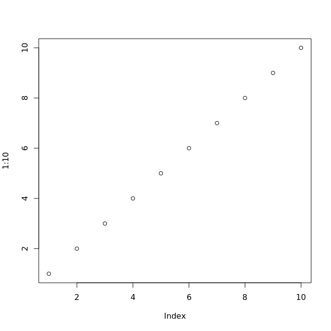

## Testing...

```r
plot(1:10)
```

<!-- -->

```r
# source('/camp/stp/babs/working/mitterr/projects/wilkinsond/monica.tambalo/hindbrain.10x/review.simple/run_analyse_Rmd.R');
```


# Session Info
***

```r
sessionInfo()
```

```
## R version 3.6.1 (2019-07-05)
## Platform: x86_64-conda_cos6-linux-gnu (64-bit)
## Running under: CentOS Linux 7 (Core)
## 
## Matrix products: default
## BLAS/LAPACK: /camp/stp/babs/working/software/anaconda/envs/R-3.6.1-BABS/lib/libopenblasp-r0.3.7.so
## 
## locale:
##  [1] LC_CTYPE=en_GB.UTF-8       LC_NUMERIC=C              
##  [3] LC_TIME=en_GB.UTF-8        LC_COLLATE=en_GB.UTF-8    
##  [5] LC_MONETARY=en_GB.UTF-8    LC_MESSAGES=en_GB.UTF-8   
##  [7] LC_PAPER=en_GB.UTF-8       LC_NAME=C                 
##  [9] LC_ADDRESS=C               LC_TELEPHONE=C            
## [11] LC_MEASUREMENT=en_GB.UTF-8 LC_IDENTIFICATION=C       
## 
## attached base packages:
## [1] stats     graphics  grDevices utils     datasets  methods   base     
## 
## other attached packages:
## [1] kableExtra_1.1.0 rmarkdown_1.12   knitr_1.22      
## 
## loaded via a namespace (and not attached):
##  [1] Rcpp_1.0.3        rstudioapi_0.10   xml2_1.2.0       
##  [4] magrittr_1.5      hms_0.4.2         rvest_0.3.3      
##  [7] munsell_0.5.0     viridisLite_0.3.0 colorspace_1.4-1 
## [10] R6_2.4.1          rlang_0.4.2       stringr_1.4.0    
## [13] httr_1.4.1        tools_3.6.1       webshot_0.5.1    
## [16] xfun_0.6          htmltools_0.4.0   yaml_2.2.0       
## [19] digest_0.6.23     tibble_2.1.3      lifecycle_0.1.0  
## [22] crayon_1.3.4      formatR_1.7       readr_1.3.1      
## [25] codetools_0.2-16  glue_1.3.1        evaluate_0.13    
## [28] stringi_1.4.3     compiler_3.6.1    pillar_1.4.2     
## [31] scales_1.1.0      pkgconfig_2.0.3
```
<br><br><br>

